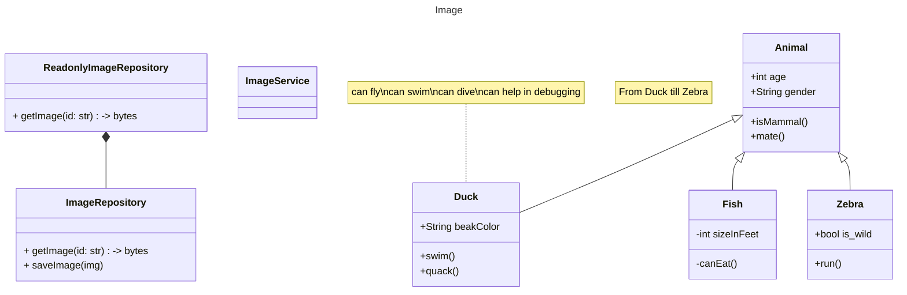

```mermaid
---
title: Image 
---
classDiagram
    class ImageRepository{
        + getImage(id: str) -> bytes
        + saveImage(img)
    }
    class ReadonlyImageRepository {
        + getImage(id: str) -> bytes
    }
    ReadonlyImageRepository *-- ImageRepository
    class ImageService {
        
    }
    note "From Duck till Zebra"
    Animal <|-- Duck
    note for Duck "can fly\ncan swim\ncan dive\ncan help in debugging"
    Animal <|-- Fish
    Animal <|-- Zebra
    Animal : +int age
    Animal : +String gender
    Animal: +isMammal()
    Animal: +mate()
    class Duck{
        +String beakColor
        +swim()
        +quack()
    }
    class Fish{
        -int sizeInFeet
        -canEat()
    }
    class Zebra{
        +bool is_wild
        +run()
    }

```